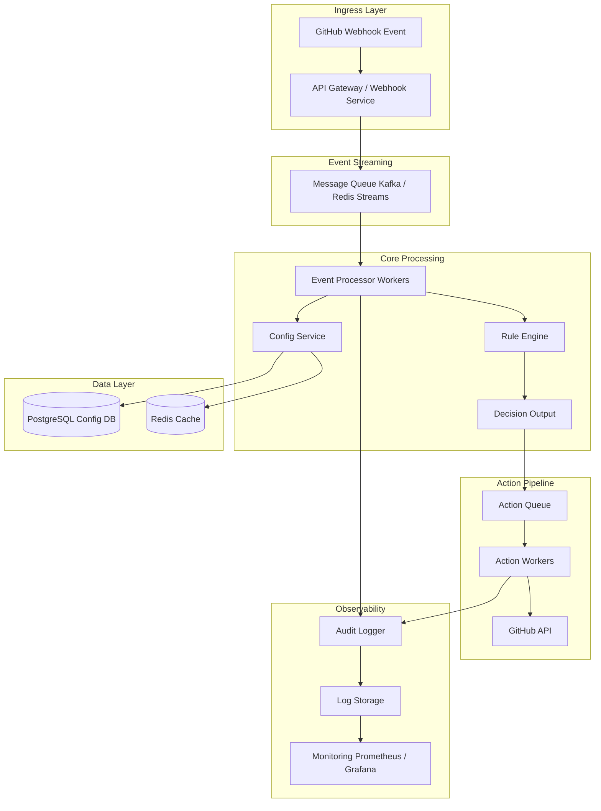

 ## Overview 

This project is a prototype of a configurable automation system for GitHub repository workflows. It is designed to reduce maintainer overhead by automating repetitive tasks such as contributor onboarding, pull request handling, and workflow enforcement.

The system demonstrates a scalable architecture where repository events are processed through a rule-based engine, resulting in automated actions with full auditability and safety controls.

---

## Objectives

- Reduce manual coordination tasks for maintainers
- Provide consistent and configurable automation across repositories
- Ensure safety, transparency, and auditability of automated actions
- Demonstrate a reusable architecture for workflow orchestration

---

## Architecture




---


### Components

- **Webhook Handler**: Receives and processes repository events
- **Configuration Loader**: Loads repository-specific rules from YAML
- **Rule Engine**: Evaluates conditions and determines actions
- **Action Executor**: Executes actions via GitHub API (or dry-run mode)
- **Audit Logger**: Records decisions, actions, and metadata for traceability

---

## Features

### Config-Driven Automation

Workflow behavior is defined using a YAML configuration file:

```yaml
rules:
  - condition: "new_contributor"
    action: "comment_welcome"

  - condition: "no_assignee"
    action: "assign_default_reviewer"
```

### Rule Engine

- The system evaluates incoming events against defined rules and determines which actions to execute.

### Action Execution

Supports both:

- Dry-run mode (safe simulation)
- Live mode (real GitHub API execution)

Implemented actions:

- Comment on pull requests
- Assign reviewers (with safety checks)


### Safety Mechanisms
- Prevents assigning a pull request author as reviewer
- Supports dry-run mode for safe testing
- Handles API errors gracefully


### Audit Logging

All decisions are logged with structured metadata:

- Unique log ID
- Repository and actor information
- Evaluated actions
- Reasoning for decisions
- Execution mode (dry-run or live)
- Timestamp


Example:

```yaml
{
  "event": "pull_request.opened",
  "repository": { "name": "Akash504-ai/Hiero-workflow-demo" },
  "actor": { "username": "Akash504-ai" },
  "decision": {
    "actions": ["comment_welcome", "assign_default_reviewer"],
    "reason": "matched rules: comment_welcome, assign_default_reviewer"
  },
  "metadata": {
    "mode": "live"
  }
}
```


### Demo

A demonstration of the system includes:

- Starting the local server
- Triggering a pull request event via API
- Rule evaluation and action execution
- Automatic comment on a real GitHub pull request
- Audit log generation

### 📸 Demo Walkthrough

### PR before img


### First terminal img 


### second terminal img


### First termianl img again (after img)


### PR screen after img


### Repository Used for Demo

This prototype was tested on: ***[Akash504-ai/Hiero-workflow-demo](https://github.com/Akash504-ai/Hiero-workflow-demo)***


## How to Run

### 1. Install dependencies

```bash
npm install
```

### 2. Configure environment variables

Create a .env file:
```yaml
GITHUB_TOKEN=your_personal_access_token
DRY_RUN=false
```

### 3. Start the server

```bash
npm run dev
```

### 4. Trigger an event

Use PowerShell or any HTTP client:

```yaml
Invoke-RestMethod -Uri "http://localhost:3000/webhook" `
-Method POST `
-ContentType "application/json" `
-Body '{
  "pull_request": {
    "number": 1,
    "author_association": "NONE",
    "assignees": [],
    "user": { "login": "your-username" }
  },
  "repository": {
    "full_name": "your-username/your-repo"
  }
}'
```

### Key Design Considerations

Configurability

Rules are externalized into configuration, allowing different repositories to define their own policies without modifying core logic.

### Separation of Concerns
- Decision-making is handled by the rule engine
- Execution is handled by the action layer
- Logging is handled independently

### Safety and Trust
- Dry-run mode prevents unintended changes
- Explicit rule-based decisions ensure predictability
- Audit logs provide transparency and traceability


### Scalability

The architecture is designed to support:

- Multiple repositories
- Different workflow configurations
- Additional automation features without major refactoring

### Future Improvements
- GitHub App integration for real webhook events
- Persistent storage for audit logs (database or external logging system)
- Advanced rule conditions and policy enforcement
- Multi-repository configuration management
- Reviewer recommendation system
- PR quality scoring and automated feedback

### Conclusion

This prototype demonstrates a practical approach to building a configurable and scalable automation framework for GitHub workflows. It focuses on safety, transparency, and maintainability, aligning with real-world requirements for managing large open-source ecosystems.

Author

Akash Santra

GitHub: [https://github.com/Akash504-ai](https://github.com/Akash504-ai)
